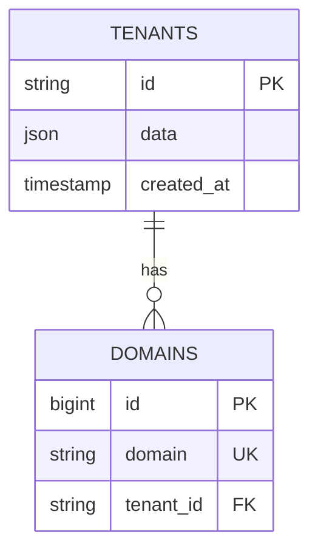
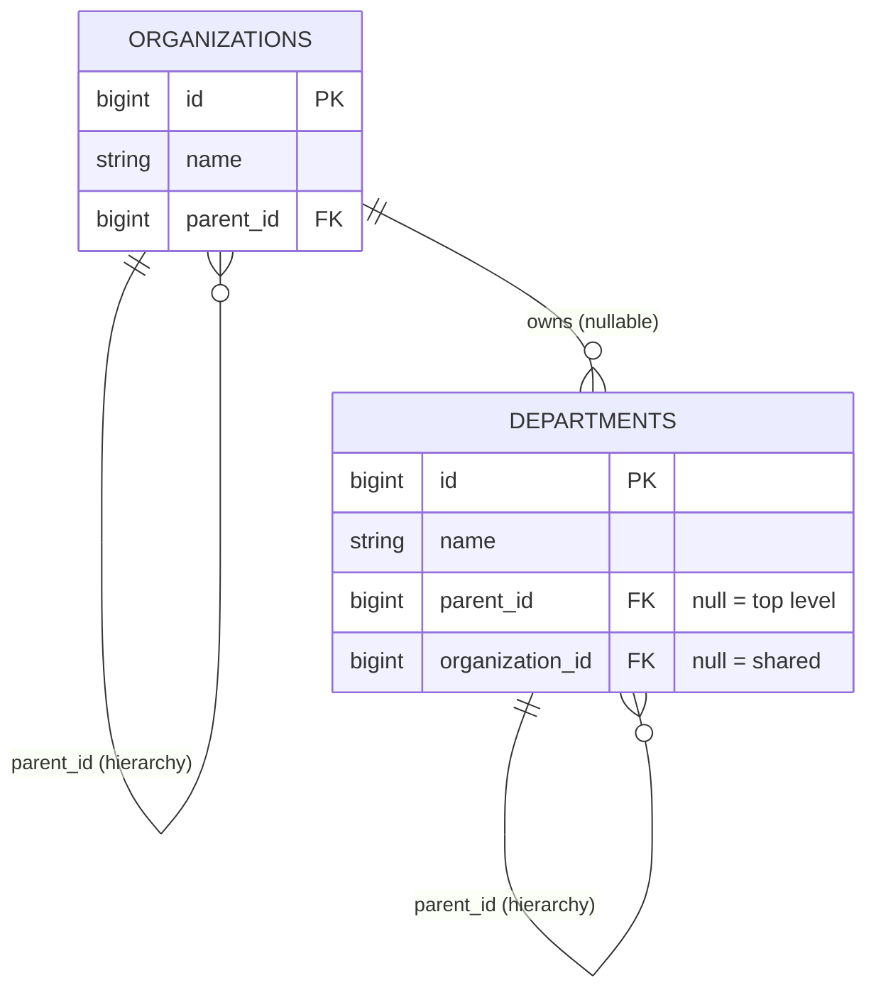
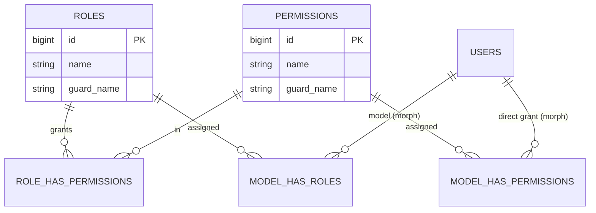
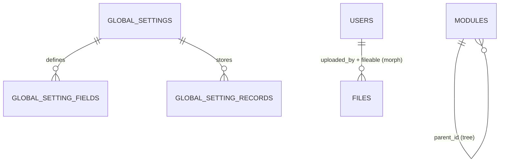

# Database — ERD

> **Status:** Current · **Last updated:** 2026-08-13 · **Owner:** Engineering

Entity-relationship diagrams generated from the **actual schema** (foreign keys
read from `information_schema`). This describes the **central** database (`elara`);
a tenant database has the same core tables **minus** `tenants` / `domains` /
`agent_conversations`, **plus** an `organization_user` membership pivot.

## Complete ERD (relationship-bearing tables)

Every table that participates in a foreign-key or polymorphic relationship.
Flat lookup tables and framework/system tables (no relationships) are listed
under [Standalone tables](#standalone-tables) below.

```mermaid
erDiagram
    TENANTS ||--o{ DOMAINS : "has"

    ORGANIZATIONS ||--o{ ORGANIZATIONS : "parent_id"
    ORGANIZATIONS ||--o{ DEPARTMENTS : "owns (nullable)"
    DEPARTMENTS ||--o{ DEPARTMENTS : "parent_id"

    ROLES ||--o{ ROLE_HAS_PERMISSIONS : "grants"
    PERMISSIONS ||--o{ ROLE_HAS_PERMISSIONS : "in"
    ROLES ||--o{ MODEL_HAS_ROLES : "assigned"
    PERMISSIONS ||--o{ MODEL_HAS_PERMISSIONS : "assigned"
    USERS ||--o{ MODEL_HAS_ROLES : "model (morph)"
    USERS ||--o{ MODEL_HAS_PERMISSIONS : "model (morph)"

    MODULES ||--o{ MODULES : "parent_id"
    GLOBAL_SETTINGS ||--o{ GLOBAL_SETTING_FIELDS : "defines"
    GLOBAL_SETTINGS ||--o{ GLOBAL_SETTING_RECORDS : "stores"

    USERS ||--o{ FILES : "uploaded_by"
    USERS ||--o{ FILES : "fileable (morph)"
    USERS ||--o{ PERSONAL_ACCESS_TOKENS : "tokenable (morph)"

    AGENT_CONVERSATIONS ||--o{ AGENT_CONVERSATION_MESSAGES : "has"

    TENANTS {
        string id PK
        json data "name,status,admin,department_mode"
        timestamp created_at
    }
    DOMAINS {
        bigint id PK
        string domain UK
        string tenant_id FK
    }
    ORGANIZATIONS {
        bigint id PK
        string name
        bigint parent_id FK
    }
    DEPARTMENTS {
        bigint id PK
        string name
        bigint parent_id FK
        bigint organization_id FK
    }
    USERS {
        bigint id PK
        string name
        string email UK
        string phone
        string designation
        json settings
        string avatar
    }
    ROLES {
        bigint id PK
        string name
        string guard_name
    }
    PERMISSIONS {
        bigint id PK
        string name
        string guard_name
    }
    ROLE_HAS_PERMISSIONS {
        bigint role_id FK
        bigint permission_id FK
    }
    MODEL_HAS_ROLES {
        bigint role_id FK
        string model_type
        bigint model_id
    }
    MODEL_HAS_PERMISSIONS {
        bigint permission_id FK
        string model_type
        bigint model_id
    }
    MODULES {
        bigint id PK
        string name
        string slug
        string type "group|item"
        boolean is_resourceful
        bigint parent_id FK
    }
    GLOBAL_SETTINGS {
        bigint id PK
        string name
    }
    GLOBAL_SETTING_FIELDS {
        bigint id PK
        bigint global_setting_id FK
        string key
        string type
    }
    GLOBAL_SETTING_RECORDS {
        bigint id PK
        bigint global_setting_id FK
        json data
    }
    FILES {
        bigint id PK
        string fileable_type
        bigint fileable_id
        string collection
        string disk
        string path
        bigint uploaded_by FK
    }
    PERSONAL_ACCESS_TOKENS {
        bigint id PK
        string tokenable_type
        bigint tokenable_id
        string name
    }
    AGENT_CONVERSATIONS {
        bigint id PK
    }
    AGENT_CONVERSATION_MESSAGES {
        bigint id PK
        bigint agent_conversation_id FK
    }
```

### Foreign keys (verified in the schema)

| Table.column | → References |
|---|---|
| `departments.organization_id` | `organizations.id` (nullable = shared) |
| `departments.parent_id` | `departments.id` (hierarchy) |
| `domains.tenant_id` | `tenants.id` |
| `files.uploaded_by` | `users.id` |
| `global_setting_fields.global_setting_id` | `global_settings.id` |
| `global_setting_records.global_setting_id` | `global_settings.id` |
| `model_has_permissions.permission_id` | `permissions.id` |
| `model_has_roles.role_id` | `roles.id` |
| `modules.parent_id` | `modules.id` (tree) |
| `organizations.parent_id` | `organizations.id` (hierarchy) |
| `role_has_permissions.permission_id` | `permissions.id` |
| `role_has_permissions.role_id` | `roles.id` |

**Polymorphic (no DB constraint):** `files.fileable_*`,
`model_has_roles.model_*`, `model_has_permissions.model_*`,
`personal_access_tokens.tokenable_*` — all resolve to `users` in practice.

### Standalone tables

No foreign keys — omitted from the relationship diagram:

- **Lookups (flat `id, name`):** `genders`, `countries`, `cities`,
  `application_types`, `designations`, `leave_types`, `document_types`.
- **Framework / system:** `cache`, `cache_locks`, `jobs`, `job_batches`,
  `failed_jobs`, `sessions`, `password_reset_tokens`, `migrations`.

## By domain (focused views)

### Tenancy

### Organizations & departments

> In a tenant database, `USERS ||--o{ ORGANIZATION_USER }o--|| ORGANIZATIONS`
> also exists (many-to-many membership); that pivot is not present in the central
> database.

### Access control (spatie, per-guard)

### Global settings & files

