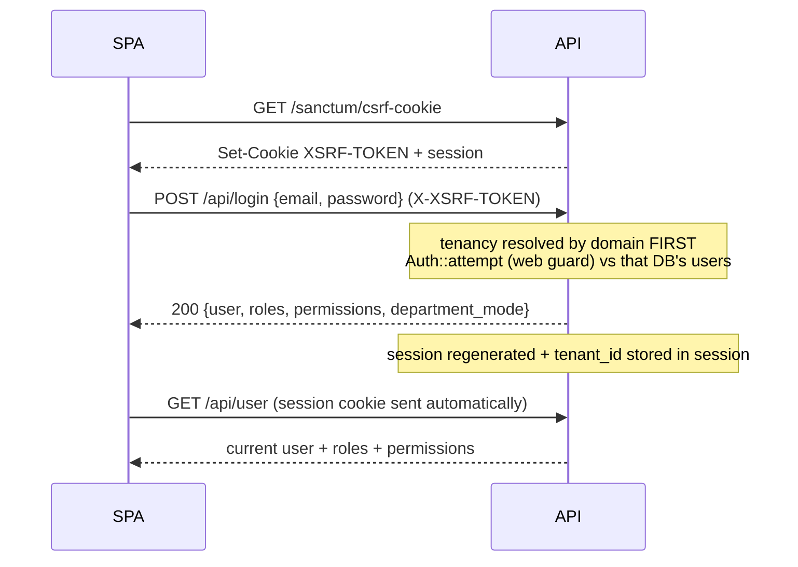

# Backend Authentication

> **Status:** Current · **Last updated:** 2026-08-19 · **Owner:** Engineering

**Authentication = who is the user?** The backend uses **Laravel Sanctum SPA
(cookie/session) auth** — the browser holds an httpOnly session cookie, not an
API token. (Frontend counterpart:
[authentication-frontend.md](authentication-frontend.md).)

## Two guards, one session

- **`web`** — the session guard. `Auth::attempt()` at login logs the user in
  under `web`, which writes the session.
- **`sanctum`** — what every `/api/*` route authenticates under
  (`auth:sanctum`). Because `statefulApi()` is enabled, requests from a stateful
  origin are authenticated **from that same web session cookie** — so
  `auth:sanctum` effectively delegates to the `web` guard for the SPA. No token
  is ever issued or sent.

This is why authorization data must exist for **both** guards — see
[authorization-backend.md](authorization-backend.md).

## Flow

## Endpoints

| Method | Path | Middleware | Purpose |
|---|---|---|---|
| GET | `/sanctum/csrf-cookie` | — | Issue CSRF + session cookie (**call first**) |
| POST | `/api/login` | `throttle:login` | Authenticate; starts the session |
| GET | `/api/verify-tenant` | — | Public: does this tenant domain exist? |
| POST | `/api/logout` | `auth:sanctum` | Invalidate the session |
| GET | `/api/user` | `auth:sanctum` | Current user + roles + permissions |
| GET | `/api/profile/access` | `auth:sanctum` | Access matrix (roles→permissions + direct grants) |

Handled by `AuthController`, which delegates business logic to `AuthService`.

## What login actually does

1. `LoginRequest` validates only that `email` (valid email) and `password` are
   **present** — the strength policy is *not* re-checked at login.
2. `AuthService::login()` calls `Auth::attempt(['email', 'password'])` against the
   **active context's** `users` table. Failure throws the same validation error
   for unknown email and wrong password, so accounts can't be enumerated.
3. On success the controller **regenerates the session** (fixation defence) and
   stores `tenant_id` in the session.
4. The response payload is `{ user, roles, permissions, department_mode }`.

Logout calls `Auth::guard('web')->logout()`, then invalidates the session and
regenerates the CSRF token.

## Which database authenticates?

Tenancy is resolved **before** auth (`InitializeTenancyIfTenantDomain` is
prepended to the `api` and `web` groups, ahead of Sanctum's session layer). So
the session store *and* the `users` table behind `Auth::attempt` both come from
the active context:

- Request to a **tenant** domain → that tenant DB's users.
- Request to the **central** domain (`127.0.0.1`) → the central DB's users.

## Session ↔ tenant binding

The session cookie is scoped to the parent domain and reaches every tenant
subdomain. To stop a session from tenant A being replayed against tenant B:

- Login writes `tenant_id` into the session.
- `EnsureUserBelongsToTenant` compares the session's `tenant_id` to the current
  tenant; on mismatch it logs out, invalidates the session, and returns **401**.

## Rate limiting

- **`throttle:login`** on `/api/login` — **5/min per email+IP** *and* **20/min
  per IP** (both must pass).
- **`throttleApi()`** globally on `/api/*` — **120/min** per user (IP for guests).
- **`throttle:30,1`** on avatar upload and a few write endpoints.

## Password policy

`Password::defaults()` = **min 8 chars, mixed case, numbers, symbols**. Applies
wherever a password is *set* (user creation, tenant-admin creation, self-service
change) — not at login. Seeders bypass validation.

## CSRF

`/api/*` is excepted from classic web CSRF; Sanctum's stateful group enforces the
SPA CSRF check. The client sends `X-XSRF-TOKEN` from the `XSRF-TOKEN` cookie.

## Stateful domains (the gotcha)

Sanctum treats an origin as stateful (and starts a session) only when it's in
`SANCTUM_STATEFUL_DOMAINS` (currently `localhost:5173`, `*.localhost:5173`). A
login from a non-listed origin throws **"Session store not set on request"**.

## Not currently implemented

- **Registration** — no public sign-up; users are seeded or created by admins.
- **Password reset** — `password_reset_tokens` exists (Laravel default) but no
  reset flow is wired.
- **API-token auth** — `personal_access_tokens` exists but the SPA uses cookies.
- **Two-factor auth / email verification** — not wired.
