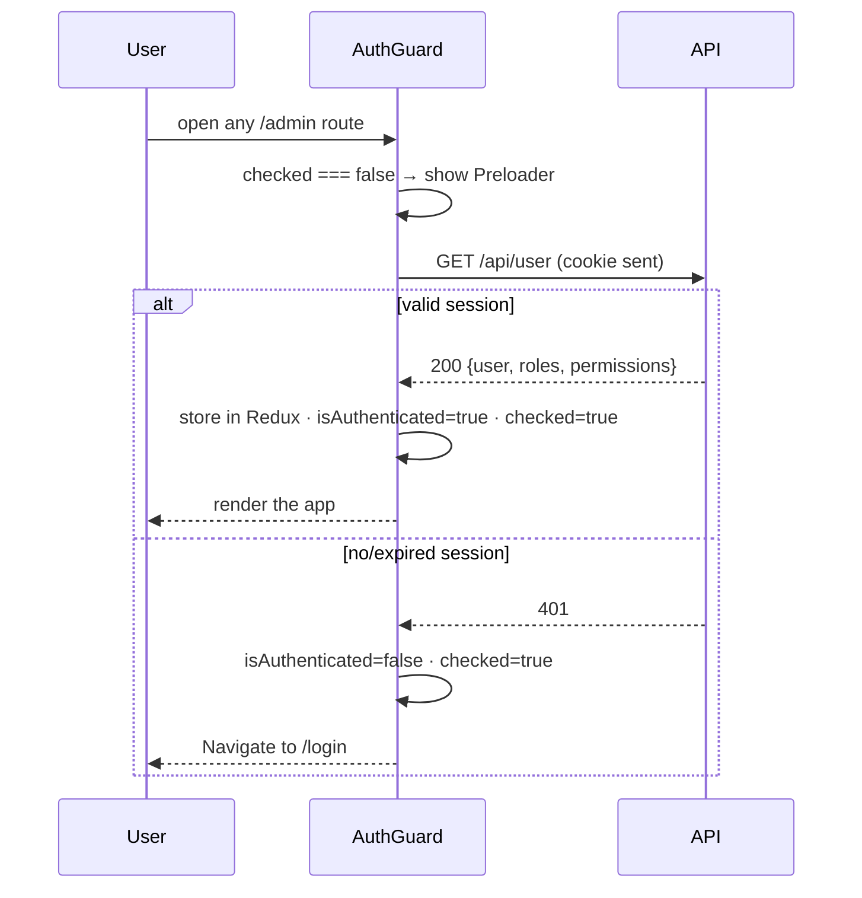
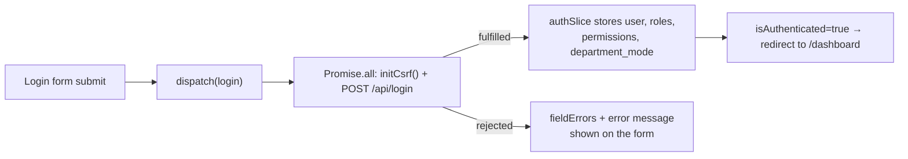

# Frontend Authentication

> **Status:** Current · **Last updated:** 2026-08-19 · **Owner:** Engineering

The SPA's job in authentication is small but specific: **prove identity with
cookies** and keep a copy of the signed-in user in Redux so the UI can react.
The cookie — not Redux — is the source of truth. (Backend counterpart:
[authentication-backend.md](authentication-backend.md).)

## The moving parts

| Piece | File | Role |
|---|---|---|
| axios instance | `services/apiClient.ts` | `withCredentials` + `withXSRFToken`, per-host base URL |
| auth slice | `store/authSlice.ts` | `login` / `logout` / `fetchUser` thunks + auth state |
| the gate | `components/AuthGuard.tsx` | Blocks the admin layout until identity is known |
| 401 interceptor | `store/index.ts` | Session died mid-use → force logout |
| tenant check | `app/providers.tsx` | Verifies the tenant domain before rendering |

## App-load flow (the session probe)

Auth state is **not** persisted to `localStorage`. On every load the SPA asks the
server who it is, so a stale client can never think it's logged in.



The `checked` flag is what makes this flicker-free: the guard shows a `Preloader`
until the probe resolves, so the app never flashes the login page before the
`/user` call returns.

## Login flow



`login` runs the CSRF-cookie request and the login POST **in parallel**
(`Promise.all`) — the two don't depend on each other, so the total wait is the
slower of the two, not their sum.

## What the auth slice holds

```ts
{ user, roles: string[], permissions: string[],
  departmentMode, isAuthenticated, loading, error, fieldErrors, checked }
```

- `roles` / `permissions` come straight from the login / `/user` payload. Today
  they're used for **display** (Profile → Access) — see
  [authorization-frontend.md](authorization-frontend.md) for how UI gating does
  (and doesn't) use them.
- `departmentMode` is tenant config that drives the Department form.
- `fieldErrors` feeds AntD form fields on a rejected login.

## Losing the session mid-use

A `401` on any later request (cookie expired/revoked) is caught by the response
interceptor in `store/index.ts`: if the user *was* authenticated it dispatches
`clearCredentials()` and clears caches, so `AuthGuard` bounces them to `/login`.
The `isAuthenticated` guard stops the routine first-load `401` from churning
state.

## Tenant verification

`TenantVerificationProvider` (in `app/providers.tsx`) blocks rendering on a
tenant subdomain until `GET /api/verify-tenant` confirms the tenant exists;
unknown/unreachable tenants are redirected to the central host. Central hosts
skip this entirely.

## Not implemented on the client

- **`/forgot-password`** route renders a placeholder page — there's no backend
  reset flow behind it (see
  [authentication-backend.md](authentication-backend.md#not-currently-implemented)).
- **No "remember me" / token storage** — cookies only.
