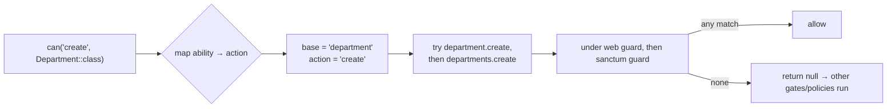
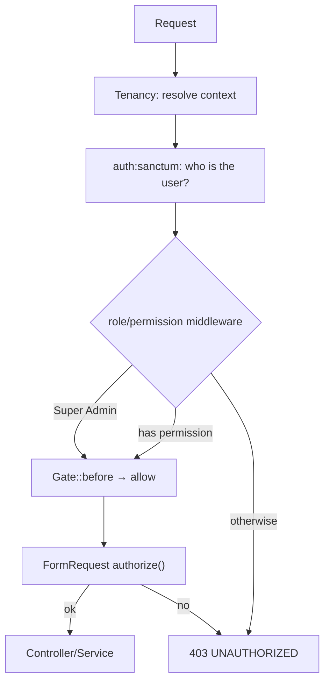

# Backend Authorization

> **Status:** Current · **Last updated:** 2026-08-19 · **Owner:** Engineering

**Authorization = what can the user do?** Enforced entirely on the backend by
**spatie/laravel-permission**. The frontend does not decide access — it only
reacts to the server (see
[authorization-frontend.md](authorization-frontend.md)). **The API is the source
of truth.**

## Layers

Authorization is enforced in two places for defence in depth:

1. **Route middleware** — `permission:<module>.<action>` and `role:<name>` guards:
   ```php
   Route::get('/users', [UserController::class, 'index'])
       ->middleware('permission:users.view');
   ```
2. **FormRequest `authorize()`** — a second check on write actions
   (`$this->user()->can(...)` / `hasRole(...)`).

Central-only routes add the `central` middleware (keeps them off tenant domains)
and usually `role:Super Admin` — e.g. tenant management and the Module Builder.

## Guards (important)

Roles and permissions exist for **two guards**: `web` (default) and `sanctum`
(the SPA's API). A permission check runs under the request's guard, so grants
must exist for both. Seeders create both (see [permissions.md](permissions.md)).

## Model abilities → permission names (the bridge)

FormRequests authorize with **model-based abilities**, e.g.
`can('create', Department::class)`. Normally Laravel would look for a **Policy** —
but this app ships **no policies**. A second `Gate::before` in
`AppServiceProvider` bridges the gap: it maps the ability to a permission name and
lets the permission system decide.



- **Ability → action map:** `viewAny`/`view` → `view`, `create` → `create`,
  `update` → `edit`, `delete` → `delete`.
- Tries **singular then plural** prefixes (`department.*` / `departments.*`),
  under **both guards**. Returns `null` on no match so unrelated gates still run.

## Super Admin bypass

`Super Admin` gets the **first** `Gate::before` hook — it passes **every** check
without holding explicit permissions. It short-circuits before the bridge above.

## Authorization flow



## Not currently implemented

- **Policies** — `app/Policies` doesn't exist; model `can()` checks resolve via
  the bridge above instead of policy classes.
- **Per-organization role scoping (spatie teams)** — off; roles are global within
  a database.
