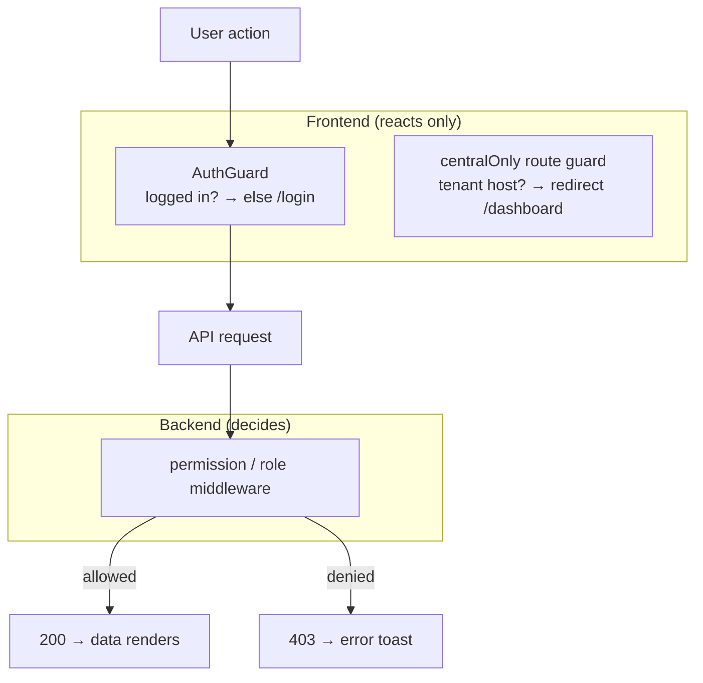

# Frontend Authorization

> **Status:** Current · **Last updated:** 2026-08-19 · **Owner:** Engineering

**The frontend does not enforce authorization.** Every access decision is made by
the backend (see [authorization-backend.md](authorization-backend.md)); the SPA
only *reacts* to it. This page describes exactly what the client does today — and,
honestly, what it does **not** yet do.

## What the client actually gates



1. **`AuthGuard`** — an **authentication** gate, not authorization. It checks
   `isAuthenticated` only; it never inspects roles or permissions.
2. **`centralOnly`** — a route `beforeLoad` guard on central-only screens
   (Tenants, Module Builder). It's a **host** check (central vs tenant), *not* a
   permission check, and its own code comment calls it "only for the address
   bar" — the real guard is the backend `central` middleware.

That's the whole of client-side gating. There is **no per-permission
show/hide**.

## Roles & permissions are present but not enforcing

The auth payload's `roles` and `permissions` are stored in Redux
(`state.auth.roles`, `state.auth.permissions`), but today they are used **only
for display** — the Profile → Access tab lists them. They do **not**:

- hide or disable action buttons (Create / Edit / Delete render for everyone),
- filter the sidebar — `useModuleTree` shows every **visible** module
  (`ModuleService::tree()` returns all `is_visible` modules with no per-user
  permission filter),
- block navigation to a module route.

**Why this is safe:** the backend rejects any unauthorized request with **403**,
which the app surfaces as an error toast. A user without `organization.create`
can *see* the button, but the POST fails server-side. Access is never actually
granted client-side — the UX is just not pre-emptively trimmed.

## Recommendation (not yet built)

The data to do client-side gating is already in Redux — it's just unused. A small
helper would improve UX without changing security:

```ts
// e.g. store/hooks or a usePermissions() hook
const can = (perm: string) =>
  roles.includes('Super Admin') || permissions.includes(perm)

// then in a page:
{can('organization.create') && <Button>New Organization</Button>}
```

Two candidate improvements:

1. **Gate action buttons** with a `can()` helper so users don't hit an
   avoidable 403.
2. **Filter the sidebar** by permission — either client-side in `useModuleTree`,
   or (better) have `ModuleService::tree()` filter to modules the user can view.

Until then, treat the backend as the *only* authorization boundary — never add a
feature that relies on the client hiding something for safety.
