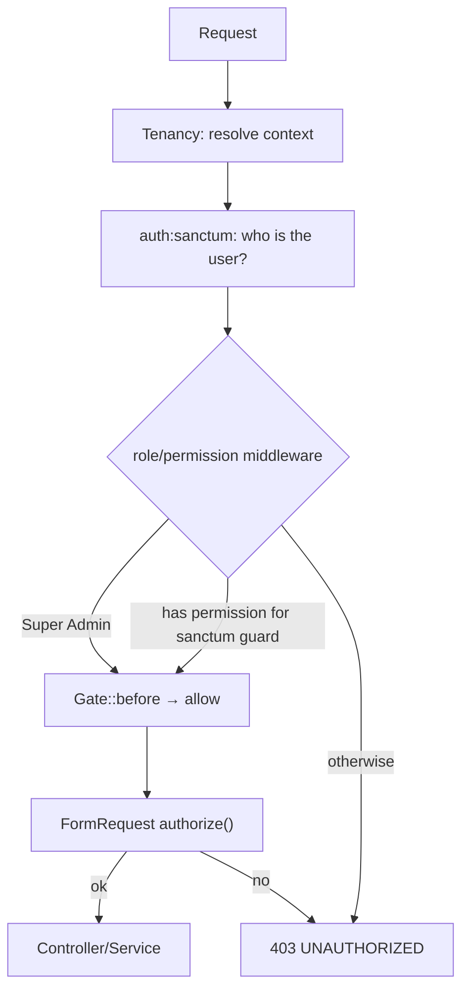

# Authorization

> **Status:** Current · **Last updated:** 2026-08-13 · **Owner:** Engineering

**Authorization = what can the user do?** Handled by **spatie/laravel-permission**.

## Layers

Authorization is enforced in two places for defence in depth:

1. **Route middleware** — `permission:<module>.<action>` and `role:<name>` guards
   on routes. Example:
   ```php
   Route::get('/users', [UserController::class, 'index'])
       ->middleware('permission:user.view');
   ```
2. **FormRequest `authorize()`** — a second check on write actions
   (`$this->user()->can(...)` / `hasRole(...)`).

Central-only routes add the `central` middleware (keeps them off tenant domains)
and usually `role:Super Admin` — e.g. tenant management and the Module Builder.

## Guards (important)

Roles and permissions exist for **two guards**:

- `web` — the default guard.
- `sanctum` — what the SPA's API requests authenticate under.

Because a permission check runs under the request's guard, permissions and role
assignments must exist for **both** guards. Seeders create both (see
[permissions.md](permissions.md)). Assigning a role by bare name only covers
`web`; code that must satisfy the SPA assigns the role for both guards.

## Super Admin bypass

`Super Admin` is granted a `Gate::before` bypass in `AppServiceProvider` — it
passes **every** permission check without holding explicit permissions. Used for
the platform operator and each tenant's owner.

## Authorization flow



## Client-side gating

The auth payload (`/api/user`, `/api/login`) includes the user's `roles` and
`permissions`; the frontend uses them to show/hide actions. This is **UX only** —
the API is the source of truth and re-checks every request.

## Not currently implemented

- **Policies** — `app/Policies` does not exist; authorization is
  middleware + FormRequest + spatie, not model policies.
- **Per-organization role scoping (spatie teams)** — teams is **off**; roles are
  global within a database. (An org-scoped variant is described in the
  multi-tenancy planning docs but not wired.)
