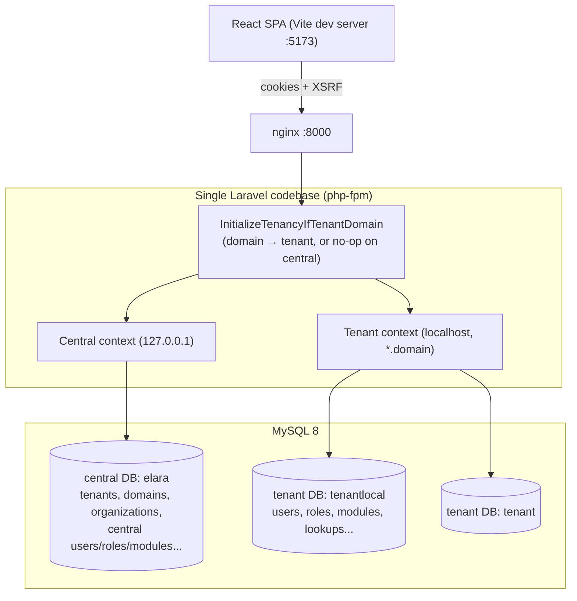
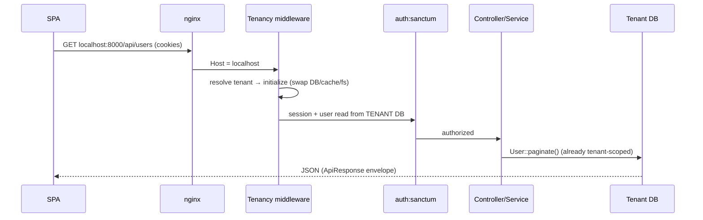

# Architecture Overview

Elara is one codebase that runs in **two contexts**, decided by the request's
domain:

- **Central app** (`127.0.0.1`) — manages tenants, organizations, and shared
  master data. Where Super Admins provision customers.
- **Tenant app** (`localhost`, and any other tenant domain) — the actual
  application a customer uses. Each tenant has an **isolated database**.

## Key ideas

**Database-per-tenant (Stancl Tenancy v3).** A request's domain is resolved to a
tenant; Stancl's bootstrappers then swap Laravel's `database`, `cache`,
`filesystem`, and `queue` bindings to that tenant for the duration of the
request. Feature code (controllers, services, Eloquent) is written exactly as in
a single-tenant app — tenancy is invisible to it.

**Cookie-based SPA auth (Sanctum).** The React SPA authenticates with session
cookies + CSRF, not API tokens. The SPA and API share an origin per context.

**DB-driven navigation.** The sidebar is built from a `modules` table (not
hardcoded), served by `GET /api/modules/tree` and cached in the browser. New
modules appear by seeding a `modules` row.

**Module Builder.** A generator scaffolds a full CRUD module (migration, model,
service, controller, requests, resource, routes, and the React page/drawers/
queries) from the UI — the fastest way to add a resource.

## Request flow (tenant)

## Where to go next

- [backend.md](backend.md) — Laravel layering, conventions, tenancy wiring.
- [frontend.md](frontend.md) — React module structure, data flow, auth.
- [database.md](database.md) — central vs tenant schema, migrations split.
