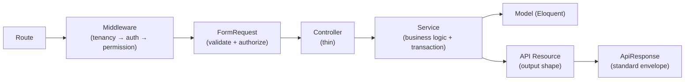

# Backend Design Patterns

> **Status:** Current · **Last updated:** 2026-08-13 · **Owner:** Engineering

The patterns the Laravel backend actually uses, with real examples. Follow these
when adding code so the codebase stays consistent. (Frontend counterpart:
[frontend.md](frontend.md).)

## The request pipeline (how the patterns fit together)



---

## 1. Service Layer (thin controllers)

Business logic lives in a **Service**, one per module. Controllers only wire a
FormRequest to a service and wrap the result. Services own transactions.

```php
class DepartmentController extends Controller
{
    public function __construct(private DepartmentService $service) {}

    public function store(StoreDepartmentRequest $request)
    {
        return ApiResponse::success(
            $this->service->create($request->validated()),
            ResponseMessage::CREATED,
            Response::HTTP_CREATED,
        );
    }
}
```

**Why:** keeps controllers trivial, makes logic reusable and testable, and gives
one place for `DB::transaction(...)`.

## 2. Dependency Injection (constructor promotion)

Services are injected into controllers via constructor property promotion
(`private DepartmentService $service`). Laravel's container resolves them. Don't
`new` a service or call the container manually inside a controller.

## 3. Response Envelope (`ApiResponse`)

Every endpoint returns the same JSON shape through `App\Helpers\ApiResponse`:

```json
{ "success": true, "message": "...", "data": {}, "errors": null }
```

Builders: `ApiResponse::success()`, `::paginated()`, `::error()`. Even
framework-thrown exceptions are normalized into this envelope in
`bootstrap/app.php` (`withExceptions`), so clients handle one shape everywhere.

## 4. Form Request (validation + authorization together)

Each write action has a `Store*Request` / `Update*Request` holding `rules()` and
`authorize()`. Validation and authorization are declarative and out of the
controller.

```php
class StoreTenantRequest extends FormRequest
{
    public function authorize(): bool
    {
        return auth()->user()?->hasRole('Super Admin') ?? false;
    }

    public function rules(): array { /* ... */ }
}
```

## 5. API Resource (output transformation)

Models are never returned directly — an `*Resource` defines the JSON shape. This
decouples the DB schema from the API contract (e.g. `TenantResource` exposes a
`database` field but deliberately hides `admin_password`).

## 6. Convention-over-configuration route auto-loading

`bootstrap/app.php` globs `routes/modules/*.php` and registers each under the
`api` group. **Dropping a `FooApi.php` file makes its routes live** — no central
registration. This is what the Module Builder relies on.

## 7. Query Scopes (encapsulated query logic)

Reusable query fragments live as model scopes, not repeated in services.

```php
// Department: own + shared (null) + ancestor-owned departments
public function scopeAvailableTo(Builder $query, ?int $organizationId): Builder
```

## 8. Trait + Polymorphic relationship (`HasFiles`)

Cross-cutting behavior is shared via a trait. `HasFiles` gives any model a
polymorphic `files()` relation and the upload/attach flow (used for user
avatars), stored per-tenant on disk.

## 9. Value Object / typed constant (`DepartmentMode`)

`App\Support\DepartmentMode` (`shared` / `scoped` / `flexible`) centralizes the
allowed values and their meaning instead of scattering magic strings. Similarly,
`App\Constants\ResponseMessage` holds user-facing strings.

## 10. Custom Validation Rule (`AssignableRole`)

Non-trivial validation is a first-class `App\Rules\*` object
(`AssignableRole`) rather than an inline closure, so it's reusable and testable.

## 11. Job Pipeline (tenant provisioning)

Tenant creation fires Stancl's `TenantCreated` event through a **job pipeline**:
`CreateDatabase → MigrateDatabase → SeedDatabase`. Each step is an isolated,
retryable job; the pipeline runs queued in normal operation.

## 12. Multi-tenancy: database-per-tenant + bootstrappers

Middleware (`InitializeTenancyIfTenantDomain`) resolves the tenant from the
request domain, then Stancl **bootstrappers** transparently swap Laravel's
`database` / `cache` / `filesystem` / `queue` bindings to that tenant. Feature
code is written as if single-tenant — the pattern makes tenancy invisible to it.

## 13. Guard-based Authorization + gate bypass

spatie permissions are checked under the request's **guard**; roles/permissions
exist for both `web` and `sanctum`. `Super Admin` gets a `Gate::before` bypass
over every check. Route middleware (`permission:foo.view`, `role:Super Admin`,
`central`) enforces access before the controller runs.

---

## Patterns intentionally **not** used

Documented so you don't go looking for them:

- **Repository pattern** — services talk to Eloquent directly; there is no
  repository layer. *(Recommendation: only introduce one if a service needs to
  swap data sources — not currently warranted.)*
- **Events / Listeners** — `app/Events` and `app/Listeners` don't exist; the only
  domain event flow is Stancl's tenancy events.
- **Policies** — no `app/Policies`; authorization is middleware + FormRequest +
  spatie, not model policies.
- **CQRS / Actions-as-classes / DTO layer** — not used; the Service + FormRequest
  pair covers this app's needs.

## Applying the patterns

When adding a module, you touch each pattern once: migration → model
(`#[Fillable]`, scopes, traits) → FormRequest → Resource → Service → thin
Controller → `routes/modules/<Module>Api.php`. See
[../development/adding-module.md](../development/adding-module.md).
