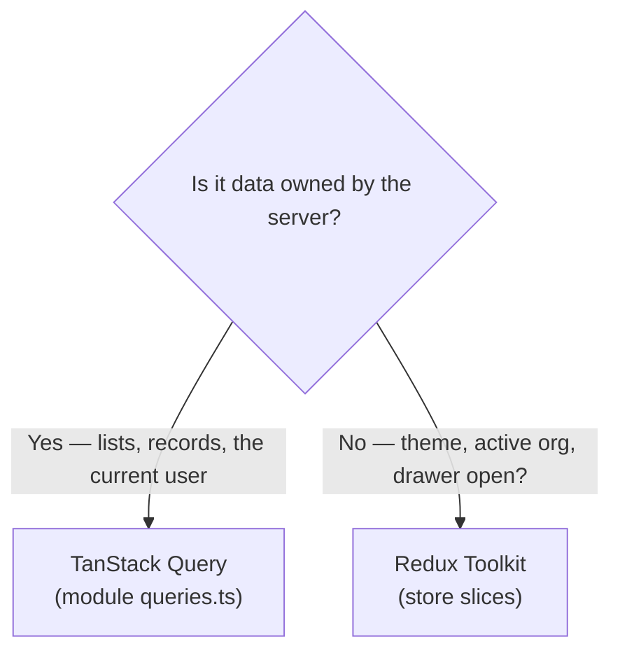

# Frontend Design Patterns

> **Status:** Current · **Last updated:** 2026-08-19 · **Owner:** Engineering

The patterns the React SPA actually uses, with real examples. Follow these when
adding UI so the codebase stays consistent. (Backend counterpart:
[backend.md](backend.md).)

## The golden rule: two kinds of state

The single most important decision in this frontend is **where state lives**:



- **Server state → TanStack Query.** Anything fetched from the API lives in a
  query cache, never copied into Redux. Caching, refetching, and invalidation are
  Query's job.
- **Client state → Redux Toolkit.** Theme/layout (`ui`), the signed-in user
  (`auth`), the active organization (`org`), and per-module UI flags.

Mixing these (e.g. dumping fetched lists into Redux) is the anti-pattern to avoid.

## 1. Feature-module structure

Each feature is a self-contained folder under `src/modules/<name>/` — `pages/`,
`components/`, `queries.ts`, `types.ts`, and an optional `<name>Slice.ts`. Adding
a feature means mirroring an existing module, not touching a central file. See
[../05-project-structure/frontend.md](../05-project-structure/frontend.md).

## 2. Query hooks + key-based invalidation

Server data is exposed as `use*` hooks in the module's `queries.ts`. Mutations
**invalidate by key prefix**, so one write refreshes every related list.

```ts
export function useOrganizations(params: ServerTableParams) {
  return useQuery({
    queryKey: ['organizations', params],
    queryFn: async () => (await apiClient.get('/organizations', { params })).data,
    placeholderData: keepPreviousData, // smooth pagination — no flash to empty
  })
}

export function useCreateOrganization() {
  const qc = useQueryClient()
  return useMutation({
    mutationFn: (values) => apiClient.post('/organizations', values),
    onSuccess: () => qc.invalidateQueries({ queryKey: ['organizations'] }),
  })
}
```

Because the picker list uses `['organizations', 'options']` — the same prefix —
the create/update/delete invalidations refresh it too.

## 3. Central API client (one axios instance)

`services/apiClient.ts` is the only place that talks HTTP:

- `withCredentials` + `withXSRFToken` — Sanctum cookie auth (see
  [../08-authentication-authorization/authentication.md](../08-authentication-authorization/authentication.md)).
- **Per-host base URL** — the hostname is taken from `window.location` so a
  tenant subdomain (`acme.localhost:5173`) calls its own backend
  (`acme.localhost:8000`), not central.
- A **request interceptor** strips `Content-Type` for `FormData` so file uploads
  keep their multipart boundary.

## 4. Global 401 interceptor (decoupled from the client)

The response interceptor that reacts to an expired session lives in
`store/index.ts`, **not** `apiClient.ts` — registering it where the store is
already imported avoids a store ↔ apiClient import cycle.

```ts
apiClient.interceptors.response.use(r => r, (error) => {
  if (error?.response?.status === 401 && store.getState().auth.isAuthenticated) {
    store.dispatch(clearCredentials()) // AuthGuard then redirects to /login
    clearClientCaches()
  }
  return Promise.reject(error)
})
```

The `isAuthenticated` guard stops the routine "not logged in yet" 401 from
churning state.

## 5. Provider composition

`app/providers.tsx` nests every cross-cutting provider in one place:
`Redux Provider → QueryClientProvider → ThemeProvider → TenantVerificationProvider`.
A component needs a context? It's wired here, once.

## 6. Theme bridge (Redux → AntD + Tailwind)

`ThemeProvider` reads the Redux `ui` slice and pushes it into AntD's
`ConfigProvider` tokens (algorithm, primary color, radius, font) **and** toggles
the Tailwind `.dark` class on `<html>` — so the whole app re-themes from a single
source of truth.

## 7. Typed Redux hooks

Always use the typed `useAppSelector` / `useAppDispatch`
(`store/hooks.ts`, via `withTypes`) — never the bare react-redux hooks — so state
and dispatch are fully typed.

## 8. Side-effect persistence via `store.subscribe`

Reducers stay pure; persistence is a subscriber. `store.subscribe` writes the UI
settings and the selected org to `localStorage` **only when the persisted subset
actually changes**, so unrelated dispatches don't touch disk.

## 9. Server errors → form fields

`utils/formErrors.ts` maps a Laravel validation response
(`{ errors: { field: [msg] } }`) onto AntD form fields:

```ts
if (applyServerErrors(error, form)) return   // field-level errors shown inline
toast.error(serverMessage(error))            // otherwise a general toast
```

## 10. String → component registry (icons)

`config/iconRegistry.ts` maps an icon **name string** (stored in the `modules`
table) to its AntD component. The dynamic sidebar and the Module Builder's icon
picker share the exact same keys; unknown names resolve to no icon.

## 11. Data-driven dynamic navigation

The sidebar isn't hard-coded — `useModuleTree` builds it from the backend
`modules` table (`/modules/tree`), resolving icons through the registry (#10).
The tree returns every **visible** module (`is_visible`); it is **not** filtered
per-user by permission. New backend module → new nav item, no frontend change.

## 12. Reusable presentational components

Cross-module UI (`DataTable`, `PageHeader`, `Add*Drawer`) lives in
`src/components/`. `DataTable` is **server-driven** — it emits `ServerTableParams`
(page, sort, filters) that flow straight into the query key (#2).

## 13. Auth-gated UI (authorization is backend-only)

`AuthGuard` gates the admin layout on **authentication** (`isAuthenticated`), and
`centralOnly` guards central-only routes by **host**. The auth payload's
`roles` / `permissions` are held in Redux but currently only **displayed**
(Profile → Access) — they don't yet hide buttons or filter nav. All real
authorization is the backend's 403 (see
[../08-authentication-authorization/authorization-frontend.md](../08-authentication-authorization/authorization-frontend.md)).

## 14. Marker-comment code generation

The Module Builder scaffolds a new module *and* splices its reducer into the
store at the `// __MODULE_REDUCER_IMPORTS__` / `// __MODULE_REDUCERS__`
sentinels in `store/index.ts`. Leave those markers in place — they're the
codegen insertion points (the frontend mirror of the backend Module Builder).

---

## Patterns intentionally **not** used

- **Server data in Redux** — deliberately avoided; TanStack Query owns it (see
  the golden rule). Don't reintroduce fetched lists into slices.
- **Saga / observable middleware** — only default RTK thunks (the `auth` slice's
  `login`/`logout`/`fetchUser`); no redux-saga.
- **SSR / a meta-framework** — this is a Vite SPA, not Next.js.
- **A custom design system** — UI is Ant Design + Tailwind utilities, not a
  bespoke component library.

## Applying the patterns

New feature = new `src/modules/<name>/` folder: `types.ts` → `queries.ts`
(hooks + invalidation) → `pages/<Name>Page.tsx` (DataTable + PageHeader) →
`components/Add<Name>Drawer.tsx` (form + `applyServerErrors`) → optional
`<name>Slice.ts` for local UI state → register the route in `routes/index.tsx`.
See [../development/adding-module.md](../development/adding-module.md).
