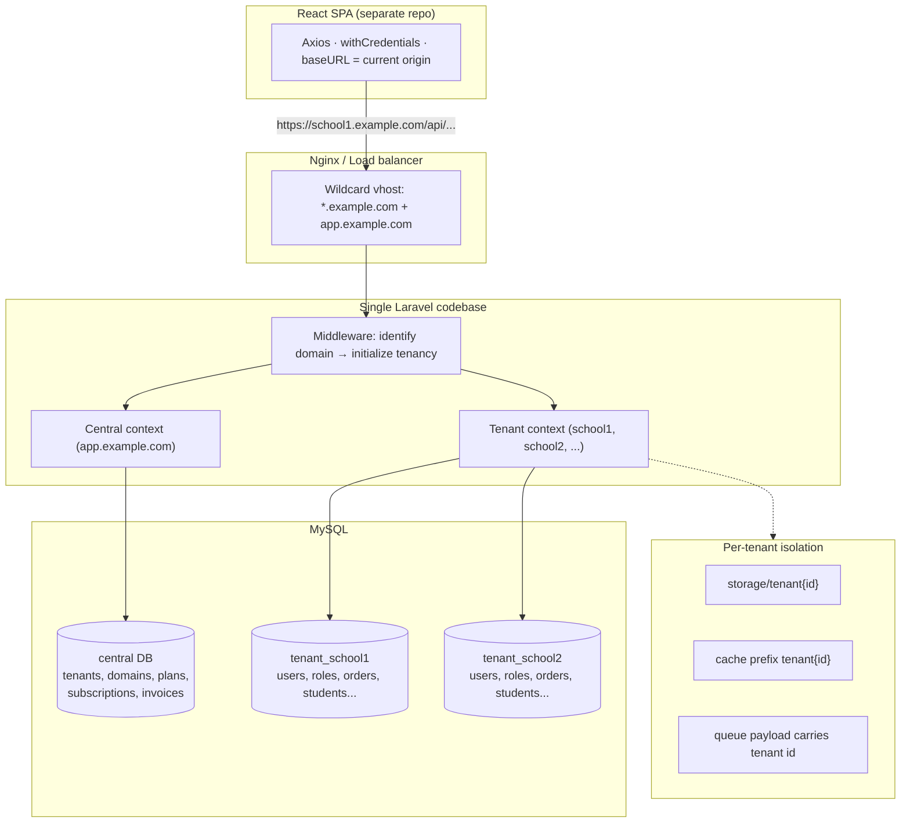
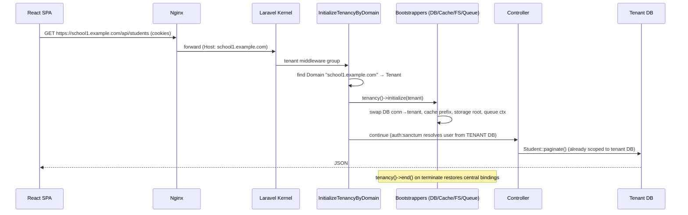
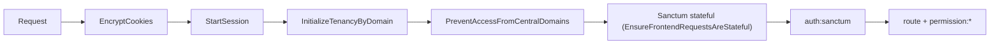
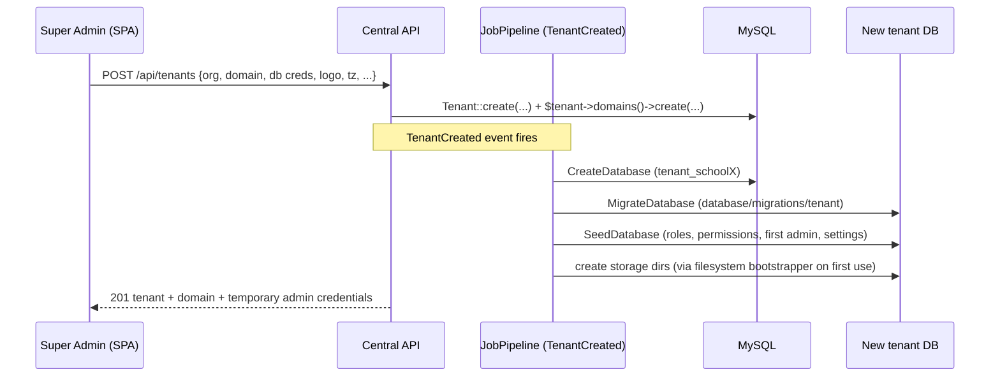
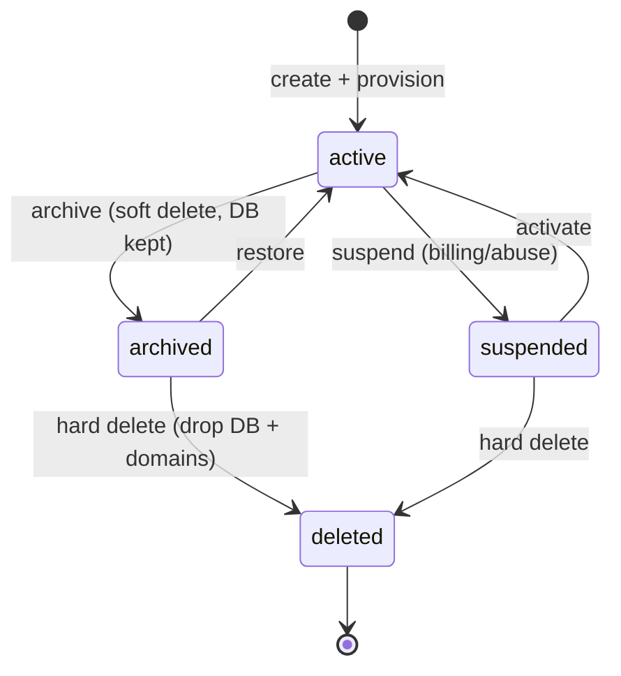
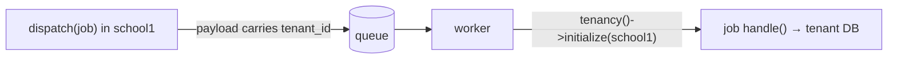

# Multi-Tenant SaaS with Stancl Tenancy v3 — Implementation Guide

Status: **reference design** · Companion to [multi-tenancy-plan.md](multi-tenancy-plan.md)

> **Read this first.** This guide describes **database-per-tenant, domain-identified**
> tenancy using `stancl/tenancy` v3 — the architecture requested in the prompt.
> Your repo already has [multi-tenancy-plan.md](multi-tenancy-plan.md), which
> deliberately chose a **different** starting point (row-level, single database,
> header-identified, users/roles/permissions kept central). This guide is that
> plan's **Phase 6 endgame adopted from day one**. Pick one consciously — §0 and
> §20 explain the trade and how to migrate either way.

---

## 0. Reconciliation with the existing plan, and version caveats

### 0.1 The one decision that forks everything

The pasted spec and your `docs/` plan disagree on **where users, roles and
permissions live**:

- **This guide (Stancl):** each tenant DB holds its own `users`, `roles`,
  `permissions`. A person who belongs to two tenants is two separate user rows.
  Total isolation; zero cross-tenant queries are even *possible*.
- **Your `docs/` plan:** `users`/`roles`/`permissions` stay **central**, scoped by
  `organization_id` via spatie teams. One person, one row, many memberships, an
  org switcher.

Neither is "more correct." Choose by answering: **must one human ever see more
than one tenant in a single session?**

- **No** (each customer is an island; a school admin never touches another
  school) → Stancl database-per-tenant, this guide. Simpler mental model, stronger
  isolation, easier per-tenant export/delete/GDPR.
- **Yes** (consultants, a group that owns several branches, cross-branch
  reporting later) → your `docs/` row-level plan. Cross-DB user identity is the
  thing Stancl makes hard.

### 0.2 Version compatibility — verify before installing

| Component | Your repo | Note |
|---|---|---|
| Laravel | **13.8 (fixed — we stay here)** | The prompt says 12, but we are **not** changing the Laravel version. Target Laravel 13 as installed. **Verify `stancl/tenancy` v3 declares `illuminate/*: ^13`** before installing (check its `composer.json` / changelog). If the current release doesn't support 13 yet, the resolution is on the *Stancl* side — pin to a release that adds 13 support, use a maintained fork/community package, or a small composer patch — **never** a Laravel downgrade. |
| PHP | 8.4 (constraint ^8.3) | Fine for Stancl v3. |
| Sanctum | 4.0 | Fine. Cross-domain SPA cookie auth is the subtle part — §4. |
| spatie/permission | 8.1 | Works per-tenant (tables live in the tenant DB). **Turn spatie *teams* OFF** in this model — teams is what the *central* plan needs, not this one. |

This guide keeps that caveat honest rather than pinning a version I can't verify
from here.

---

## 1. Architecture overview



**One codebase, one deployment, many databases.** A request's **domain** decides
which tenant database, cache prefix, storage path and queue context are active.
`app.example.com` is the *central* context and never touches tenant data.

Stancl does this with **bootstrappers** — small classes that swap Laravel's
`database`, `cache`, `filesystem`, `queue` and `redis` bindings to the tenant's
namespace the instant tenancy is initialized, and restore them when it ends.

---

## 2. Central vs tenant — responsibilities and schema

### 2.1 Who owns what

| Central DB (`app.example.com`) | Tenant DB (`school1.example.com`) |
|---|---|
| `tenants` | `users` |
| `domains` | `roles`, `permissions`, `model_has_*`, `role_has_permissions` |
| `plans`, `subscriptions`, `invoices` | `personal_access_tokens`, `sessions`, `cache`, `jobs` |
| `global_configurations` | business tables: `orders`, `students`, `teachers`, `attendance`, `products`, your generated modules |
| Super Admin accounts (central users) | tenant-scoped `files`, lookups if you keep them per-tenant |

**Rule:** the central DB must never contain a tenant's business data. If you find
yourself adding a `tenant_id` column to a central table to "filter it," you've
mixed the boundaries — that column belongs to database-per-tenant, not to a WHERE.

### 2.2 Central schema

```mermaid
erDiagram
    TENANTS ||--o{ DOMAINS : has
    TENANTS ||--o{ SUBSCRIPTIONS : has
    PLANS ||--o{ SUBSCRIPTIONS : "is on"
    SUBSCRIPTIONS ||--o{ INVOICES : bills

    TENANTS {
        string id PK "uuid or slug"
        json   data "stancl virtual column: name, db creds, logo, timezone..."
        string status "active|suspended|archived"
        timestamp created_at
    }
    DOMAINS {
        bigint id PK
        string domain UK "school1.example.com"
        string tenant_id FK
    }
    PLANS { bigint id PK; string name; json features; int price_cents }
    SUBSCRIPTIONS { bigint id PK; string tenant_id FK; bigint plan_id FK; string status; date ends_at }
    INVOICES { bigint id PK; bigint subscription_id FK; int amount_cents; string status; date due_at }
```

Stancl's default `Tenant` model stores arbitrary attributes in a single `data`
JSON column (the "virtual column" pattern) unless you opt into real columns. For a
production app you'll want **explicit columns** for the fields you query/sort/index
(`status`, `name`, `db_name`) and leave the rest in `data`.

### 2.3 Tenant schema

Every tenant DB is **identical** and created from `database/migrations/tenant`.
It contains a *full* app: its own `users`, spatie tables, Sanctum tables, sessions,
cache, jobs, and all business modules. Because it's physically separate, **no
`organization_id`/`tenant_id` column is needed on business tables** — the database
boundary *is* the isolation.

---

## 3. Request flow



The key insight: after `initialize`, **your controllers, services and Eloquent
models are written exactly as in a single-tenant app.** `Student::all()` returns
only school1's students because the `default` DB connection now points at
`tenant_school1`. Tenancy is invisible to feature code — same north-star as your
existing plan, achieved via a different mechanism.

---

## 4. Authentication — Sanctum cookie auth across tenant domains

This is the hardest part of the whole design. Cookie-based SPA auth assumes the
SPA and API share a cookie; with many dynamic subdomains that assumption needs
care.

### 4.1 The moving parts

```mermaid
sequenceDiagram
    participant SPA as SPA @ school1.example.com
    participant API as API @ school1.example.com

    SPA->>API: GET /sanctum/csrf-cookie
    API-->>SPA: Set-Cookie XSRF-TOKEN; SESSION (Domain=.example.com or host-only)
    SPA->>API: POST /api/login (X-XSRF-TOKEN, credentials)
    API->>API: tenancy initialized → Auth::attempt against TENANT users
    API-->>SPA: 204 + session cookie (authenticated in THIS tenant)
    SPA->>API: GET /api/profile (cookies auto-sent)
    API-->>SPA: 200 user
```

### 4.2 The four settings, and what each does

- **`SESSION_DOMAIN`** — which host(s) the session cookie is valid for.
  - `SESSION_DOMAIN=null` (host-only cookie): each tenant subdomain gets its *own*
    cookie. `school1` and `school2` sessions are naturally independent. **This is
    the safest default for isolation.** Downside: the SPA must hit the same host it
    logs in on (which it does — one SPA per tenant origin).
  - `SESSION_DOMAIN=.example.com` (leading dot): one cookie shared across *all*
    subdomains. Convenient, but now you **must** make sessions tenant-scoped
    (store them in each tenant DB) or a login on school1 leaks to school2. Only do
    this if you have a real cross-subdomain need.
  - **Recommendation for this architecture: leave it host-only (`null`).** Per-tenant
    origins already give you per-tenant cookies for free.
- **`SANCTUM_STATEFUL_DOMAINS`** — the origins Sanctum treats as "first-party" (use
  session instead of tokens). It does **not** support a `*.example.com` wildcard
  literally. Options:
  1. list known domains, or
  2. set it dynamically per request from the resolved tenant's domain (a small
     service provider that pushes the current Host into the config before Sanctum's
     middleware runs), or
  3. front everything behind one apex and rely on `SESSION_DOMAIN`.
     For thousands of tenants, **(2) dynamic** is the clean answer.
- **`config/cors.php`** — must allow the tenant origins **with credentials**:
  `'supports_credentials' => true`, and `allowed_origins` (or
  `allowed_origins_patterns` with `'#^https://[a-z0-9-]+\.example\.com$#'`) matching
  your subdomains. `paths` must include `sanctum/csrf-cookie` and `api/*`.
- **CSRF** — the SPA calls `GET /sanctum/csrf-cookie` first (on the tenant origin),
  then sends `X-XSRF-TOKEN` on mutating requests. Because the CSRF cookie is issued
  by the *same* tenant origin, this "just works" per tenant with host-only cookies.

### 4.3 Login / logout flow (per tenant origin)

1. SPA → `GET https://school1.example.com/sanctum/csrf-cookie`
2. SPA → `POST https://school1.example.com/api/login` — tenancy is already
   initialized by domain middleware, so `Auth::attempt()` runs against
   **school1's** `users` table.
3. Session cookie set for `school1.example.com`.
4. `GET /api/user`, `/api/profile`, etc. carry the cookie automatically.
5. Logout: `POST /api/logout` invalidates that tenant's session only.

### 4.4 Central (Super Admin) auth

The central app at `app.example.com` runs the **same** Sanctum flow but *without*
tenancy initialization — `Auth::attempt()` hits the **central** `users` table.
Super Admins are central users; they never appear in tenant DBs.

> **Honest caveat.** Dynamic `SANCTUM_STATEFUL_DOMAINS` and CORS patterns for
> thousands of subdomains is exactly where teams lose days. Build a tiny
> integration test that boots two tenants and asserts a login on one is *not* valid
> on the other **before** building any feature on top.

---

## 5. Middleware

### 5.1 The pieces

- **`InitializeTenancyByDomain`** — reads `Host`, finds the `Domain` row, resolves
  its `Tenant`, calls `tenancy()->initialize($tenant)`. Use
  `InitializeTenancyBySubdomain` if tenants are subdomains of one apex and you
  don't store full domains; `InitializeTenancyByRequestData` for a header/path
  (useful for local dev without wildcard DNS).
- **`PreventAccessFromCentralDomains`** — put on **tenant** routes so a request to
  `app.example.com/api/students` is rejected (that route only makes sense inside a
  tenant).
- Central routes carry neither; they run in the central context by default.

### 5.2 Order (this matters)



Tenancy must initialize **before** `auth:sanctum` (so the guard reads the tenant's
`users`) and **before** anything touching cache/storage. In Laravel 11+/13 you wire
this in `bootstrap/app.php` as a named middleware group, e.g. `->group('tenant', [...])`,
and apply that group to `routes/tenant.php`.

---

## 6. Route structure

```
routes/
  web.php        # central web (minimal for an SPA)
  api.php        # CENTRAL api: tenant CRUD, plans, billing, super-admin
  tenant.php     # TENANT api: login, profile, users, students, orders...
```

`routes/tenant.php` is registered by a `RouteServiceProvider` (or a
`bootstrap/app.php` `then:` closure) inside the tenant middleware group:

```php
// bootstrap/app.php (sketch)
->withRouting(
    api: __DIR__.'/../routes/api.php',            // central
    web: __DIR__.'/../routes/web.php',
    then: function () {
        Route::middleware(['tenant', 'api'])       // 'tenant' = the group from §5.2
            ->prefix('api')
            ->group(base_path('routes/tenant.php'));
    },
)
```

```
CENTRAL (app.example.com)                 TENANT (*.example.com)
POST   /api/tenants                       POST /api/login
GET    /api/tenants                       POST /api/logout
GET    /api/tenants/{tenant}              GET  /api/user
PUT    /api/tenants/{tenant}              GET  /api/profile
DELETE /api/tenants/{tenant}              GET  /api/users
POST   /api/tenants/{tenant}/suspend      GET  /api/students
POST   /api/tenants/{tenant}/activate     GET  /api/orders
GET    /api/plans                         ... (all your existing module routes)
```

Your current `routes/modules/{Module}Api.php` auto-loading works unchanged — those
become **tenant** routes; just load them inside the tenant group instead of the
central one.

---

## 7. Tenant creation flow (the wizard)

### 7.1 What "create tenant" runs



Stancl ships `CreateDatabase`, `MigrateDatabase`, `SeedDatabase` jobs and wires
them to the `TenantCreated` event through a `JobPipeline` in a service provider.
You register the pipeline once; every `Tenant::create()` then provisions
automatically. Run the pipeline **queued** in production (provisioning a DB +
migrating can take seconds) — the API returns immediately and the SPA polls
`GET /api/tenants/{id}` for `status: active`.

### 7.2 The wizard payload → central storage

Step 1 collects: Organization/Tenant name, DB name/username/password,
domain/subdomain, email, phone, logo, timezone, currency, language, status.

Store queryable ones as real columns; keep branding/prefs in `data`:

```php
// TenantService::create()
return DB::connection('central')->transaction(function () use ($dto) {
    $tenant = Tenant::create([
        'id'       => $dto->slug,                 // or Str::uuid()
        'name'     => $dto->organizationName,
        'status'   => $dto->status ?? 'active',
        'db_name'  => $dto->dbName,               // used by DatabaseConfig
        // virtual/data attributes:
        'email'    => $dto->email,
        'phone'    => $dto->phone,
        'timezone' => $dto->timezone,
        'currency' => $dto->currency,
        'language' => $dto->language,
    ]);

    $tenant->domains()->create(['domain' => $dto->domain]);

    // logo: store on the CENTRAL disk (tenant DB doesn't exist yet)
    if ($dto->logo) {
        $tenant->update(['logo_path' => $dto->logo->store('tenant-logos', 'public')]);
    }

    return $tenant; // TenantCreated → JobPipeline provisions DB/migrate/seed/admin
});
```

Per-tenant DB **credentials**: Stancl's `DatabaseConfig` can derive a connection
from the tenant (prefix a template connection with `tenant{id}`, or read explicit
`db_name`/`db_username`/`db_password` from the tenant). For "thousands of tenants,"
prefer **one privileged MySQL user creating per-tenant databases** with a shared
app user, rather than storing per-tenant DB passwords — fewer secrets to rotate.
If the spec truly needs per-tenant DB users, encrypt those credentials at rest.

---

## 8. Tenant lifecycle



| Action | What it does | Reversible? |
|---|---|---|
| **Create** | `Tenant::create` + provision (DB, migrate, seed, admin) | — |
| **Suspend** | `status = suspended`; middleware returns 403 for tenant domains | yes → Activate |
| **Activate** | `status = active` | — |
| **Archive** | soft delete the tenant row; **keep** the database & files | yes → Restore |
| **Restore** | un-delete the row; domain resolves again | — |
| **Delete DB** | Stancl `DeleteDatabase` job drops `tenant_{id}` | **no** |
| **Delete domain** | remove the `Domain` row | rebuildable |
| **Hard delete** | archive + delete DB + delete domains + delete `storage/tenant{id}` | **no** |

Enforce suspension in a small middleware after tenancy init:

```php
// EnsureTenantIsActive (tenant group, after InitializeTenancyByDomain)
if (tenant('status') !== 'active') {
    abort(403, 'This workspace is suspended.');
}
```

Deletion is an **operational procedure**, not a one-click button: require an
explicit confirmation + a queued job, and take a final DB dump first.

---

## 9. Storage isolation

Stancl's `FilesystemTenancyBootstrapper` suffixes each disk's root with the tenant
id, so `Storage::disk('public')->put(...)` inside a tenant writes to
`storage/app/public/tenant{id}/...` and the `local`/`public` disks are transparently
namespaced.

```
storage/
  app/public/                 # central
  tenant1/app/public/...      # school1 uploads
  tenant2/app/public/...      # school2 uploads
```

Your existing `HasFiles` trait + `File` model need **no `tenant_id` column** in this
model — the disk root already differs per tenant, and the `files` rows live in the
tenant DB. The one thing to fix: the `public/storage` symlink strategy (the one we
just wired for avatars) must resolve per tenant — Stancl provides
`suffix_storage_path` and asset-URL helpers; use `tenant_asset()` / the global URL
override rather than a single static symlink.

> Contrast with your `docs/` plan, where files carry `tenant_id`/`organization_id`
> columns because everything shares one disk. Here the filesystem *is* the boundary.

---

## 10. Cache, session, queue isolation

- **Cache** — `CacheTenancyBootstrapper` prefixes every cache key with the tenant
  id, so `Cache::get('x')` in school1 and school2 never collide. spatie's permission
  cache is naturally per-tenant because it's keyed through the same store. With
  **Redis**, `RedisTenancyBootstrapper` switches the Redis prefix/DB per tenant.
- **Session** — with host-only `SESSION_DOMAIN` (§4.2), cookies are already
  per-origin. Additionally, using the **database** session driver stores sessions in
  each tenant DB, so they're isolated even if you ever share a cookie domain.
- **Queue** — `QueueTenancyBootstrapper` **serializes the current tenant id into
  every dispatched job's payload** and re-initializes tenancy inside the worker
  before `handle()` runs. This is the piece people forget: without it, a queued
  `SendInvoice` job runs in *central* context and reads the wrong DB.



Scheduled jobs and tenant-wide commands run with `php artisan tenants:run` (§11) or
`Tenant::all()->each->run(fn () => ...)`, which loops tenants and initializes each.

---

## 11. Migrations

```
database/
  migrations/          # CENTRAL: tenants, domains, plans, subscriptions, invoices
  migrations/tenant/   # TENANT: users, spatie, sanctum, sessions, cache, jobs, business tables
```

| Command | Effect |
|---|---|
| `php artisan migrate` | central migrations only |
| `php artisan tenants:migrate` | run `migrations/tenant` against **every** tenant DB |
| `php artisan tenants:migrate --tenants=school1` | one tenant |
| `php artisan tenants:seed` | run the tenant seeder in each tenant DB |
| `php artisan tenants:rollback` | roll back tenant migrations |
| `php artisan tenants:migrate-fresh` | drop + re-migrate each tenant (dev only) |
| `php artisan tenants:run "some:command"` | run any command inside each tenant context |

Point Stancl at the tenant folder in `config/tenancy.php`:
`'migration_parameters' => ['--path' => 'database/migrations/tenant', '--realpath' => false]`.

**New tenant migrations must be deployed then rolled out** with
`tenants:migrate` (ideally queued/batched for thousands of tenants) — a code deploy
alone doesn't touch existing tenant schemas.

---

## 12. Seeder strategy

Two seeders, two audiences:

- **Central** `DatabaseSeeder` — Super Admin user(s), plans, global config.
- **Tenant** `TenantDatabaseSeeder` (run by `SeedDatabase` at creation and by
  `tenants:seed`) — default roles, default permissions, the **first admin user**
  from the wizard payload, default settings.

```php
// TenantDatabaseSeeder (runs INSIDE the tenant DB)
public function run(): void
{
    $this->call(RolePermissionSeeder::class);          // your existing seeder, unchanged

    $admin = User::create([
        'name'     => tenant('admin_name')  ?? 'Administrator',
        'email'    => tenant('admin_email'),
        'password' => tenant('admin_password') ?? Str::password(16),
    ]);
    $admin->assignRole('Super Admin');                 // tenant-local Super Admin
}
```

Because the seeder runs *in tenant context*, `User::create` writes to the tenant DB.
Your current `RolePermissionSeeder` and `ModuleSeeder` move to
`migrations/tenant` + tenant seeding essentially as-is (drop spatie *teams*).

---

## 13. React integration

Because tenant = origin, the SPA barely changes:

- **Current tenant / API URL / domain** — all three *are* `window.location.origin`.
  No tenant header, no tenant switcher, no env juggling: the SPA served from
  `school1.example.com` talks to `school1.example.com/api`. Set
  `axios.defaults.baseURL = '/api'` (same-origin) and drop the hardcoded
  `VITE_API_BASE_URL`/`VITE_BACKEND_URL` you currently use — or make them derive
  from `location.origin`.
- **Axios** — `withCredentials: true`, `withXSRFToken: true` (you already have
  this). CSRF: `GET /sanctum/csrf-cookie` before the first mutation (you already do
  this in `authSlice`).
- **Login/logout/session** — identical to today; the domain does the tenant
  selection for you.
- **Central SPA** (Super Admin console) is a *separate* app (or route set) served
  from `app.example.com`, hitting the central API.

> This is where Stancl is genuinely simpler than your `docs/` plan on the frontend:
> no `X-Organization-Id` interceptor, no org slice, no switcher, no org-prefixed
> query keys. The domain carries all of it.

---

## 14. Configuration

`config/tenancy.php` (the important knobs):

```php
return [
    'tenant_model' => \App\Models\Tenant::class,
    'domain_model' => \App\Models\Domain::class,
    'central_domains' => [
        env('CENTRAL_DOMAIN', 'app.example.com'),
        'localhost', // dev
    ],
    'bootstrappers' => [
        Stancl\Tenancy\Bootstrappers\DatabaseTenancyBootstrapper::class,
        Stancl\Tenancy\Bootstrappers\CacheTenancyBootstrapper::class,
        Stancl\Tenancy\Bootstrappers\FilesystemTenancyBootstrapper::class,
        Stancl\Tenancy\Bootstrappers\QueueTenancyBootstrapper::class,
        // Stancl\Tenancy\Bootstrappers\RedisTenancyBootstrapper::class, // if Redis
    ],
    'database' => [
        'central_connection' => env('DB_CONNECTION', 'central'),
        'template_tenant_connection' => null,
        'prefix' => 'tenant_',
        'suffix' => '',
        'managers' => [
            'mysql' => Stancl\Tenancy\TenantDatabaseManagers\MySQLDatabaseManager::class,
        ],
    ],
    'cache' => ['prefix_base' => 'tenant_'],
    'filesystem' => [
        'suffix_base' => 'tenant',
        'disks' => ['local', 'public'],
    ],
    'migration_parameters' => ['--path' => 'database/migrations/tenant', '--realpath' => false],
    'seeder_parameters'    => ['--class' => 'Database\\Seeders\\TenantDatabaseSeeder'],
];
```

`.env` — **central**:

```
APP_URL=https://app.example.com
CENTRAL_DOMAIN=app.example.com
DB_CONNECTION=central
DB_HOST=127.0.0.1
DB_DATABASE=central
SESSION_DRIVER=database
SESSION_DOMAIN=null          # host-only cookies → per-tenant isolation
SANCTUM_STATEFUL_DOMAINS=app.example.com   # tenant domains added dynamically (§4.2)
```

`config/session.php`: `'driver' => 'database'`. `config/cors.php`:
`'supports_credentials' => true`, `allowed_origins_patterns` matching
`*.example.com`, `paths` include `api/*` and `sanctum/csrf-cookie`.
`config/database.php`: add a `central` connection **and** a `tenant` template
connection (host/user/pass shared, database blank — Stancl fills it in).

---

## 15. Security

- **Database isolation** — the strongest possible: separate schemas. A bug in a
  WHERE clause can't leak across tenants because the *connection* is different.
- **Storage isolation** — per-tenant disk roots (§9).
- **Session/cache isolation** — per-tenant cookies + prefixes (§10).
- **Cross-tenant prevention** — `PreventAccessFromCentralDomains` on tenant routes;
  `EnsureTenantIsActive`; central routes never initialize tenancy.
- **Authorization** — spatie runs inside each tenant DB; a tenant's roles/permissions
  can't reference another tenant's.
- **SQL injection** — unchanged from single-tenant: Eloquent/parameter binding;
  never interpolate tenant ids into raw SQL, and validate the DB name Stancl creates
  (allowlist `[a-z0-9_]`) so a malicious "database name" in the wizard can't inject.
- **Rate limiting** — key limiters by tenant + user: `RateLimiter::for('api', fn ($r)
  => Limit::perMinute(120)->by((tenant()?->id ?: 'central').'|'.$r->user()?->id))`.
- **DB privileges** — the app's MySQL user needs `CREATE/DROP DATABASE` only if
  Stancl provisions DBs at runtime; consider a dedicated provisioning user invoked
  only by the create-tenant job, and a lower-privilege user for request traffic.

---

## 16 & 17. Domains and folder structure

Wildcard DNS `*.example.com` → your app; Nginx `server_name app.example.com
*.example.com;`. Each Host resolves its own tenant via the `domains` table.

```
app/
  Central/                     # central-only concerns
    Controllers/TenantController.php, PlanController.php
    Services/TenantService.php, TenantProvisioner.php
    Actions/{CreateTenant,SuspendTenant,DeleteTenant}Action.php
    DTO/CreateTenantData.php
  Http/
    Middleware/EnsureTenantIsActive.php
  Models/
    Tenant.php                 # extends Stancl base tenant
    Domain.php
    User.php                   # (tenant users; central users can be a separate guard/model)
  Tenancy/
    Bootstrappers/             # custom bootstrappers if needed
    Jobs/                      # CreateDatabase override, SeedDatabase params
  Providers/
    TenancyServiceProvider.php # registers the JobPipeline on TenantCreated
database/
  migrations/          (central)
  migrations/tenant/   (tenant)
  seeders/TenantDatabaseSeeder.php
routes/{api,web,tenant}.php
```

Your existing per-module layout (`app/Http/Controllers`, `app/Services`,
`routes/modules/*`) stays — those simply run inside tenant context now.

---

## 18. Best practices

Repository/Service/Action patterns, FormRequests, DTOs, API Resources, Policies,
Events/Listeners, queues, DB transactions, DI, SOLID, PSR — you already follow most
of these (service layer, FormRequests, Resources, `ApiResponse`). The
tenancy-specific ones:

- **Provision inside a queued JobPipeline**, wrapped so a failed migrate/seed
  **rolls back** (drop the half-created DB) — a half-provisioned tenant is worse
  than none.
- **Never** run a tenant query in central context by accident: guard console
  commands and jobs; `tenancy()->initialized` should be asserted where it matters.
- Keep central and tenant **User models/guards distinct** so a Super Admin token can
  never authenticate against a tenant.

---

## 19. Common pitfalls → solutions

| Pitfall | Symptom | Fix |
|---|---|---|
| Queued job runs central | job reads empty/central DB | `QueueTenancyBootstrapper` enabled; job dispatched *inside* tenancy |
| `SANCTUM_STATEFUL_DOMAINS` lacks the tenant host | login returns a token / 419 CSRF | dynamic stateful-domains per request (§4.2) |
| Shared `SESSION_DOMAIN=.example.com` without tenant sessions | logged into one tenant = logged into all | host-only cookie **or** database sessions per tenant |
| `storage:link` single symlink | tenant assets 404 / cross-leak | per-tenant `suffix_storage_path` + `tenant_asset()` |
| spatie **teams** left on | roles behave oddly across tenants | teams **off** in this model (teams is for the *central* row-level plan) |
| Central migration placed in `migrations/tenant` (or vice-versa) | `tenants` table missing / tenant DB missing app tables | strict folder discipline; CI check |
| No wildcard DNS in dev | can't reach `school1.localhost` | `InitializeTenancyByRequestData` (header/path) locally, or `*.localhost`/dnsmasq |
| Tenant deleted, DB orphaned | disk fills with dead schemas | `DeleteDatabase` job on tenant delete + a reconcile command |
| Laravel 13 ↔ Stancl v3 version mismatch | composer conflict on install | verify constraint first (§0.2) |

---

## 20. Testing strategy

- **Isolation first, features second.** A `tests/Feature/TenantIsolationTest.php`
  that: boots two tenants, creates a `Student` in each, asserts each tenant sees
  only its own; asserts a login on tenant A is invalid on tenant B; asserts a queued
  job dispatched in A runs in A's DB.
- Base test helper `runForTenant(Tenant $t, Closure $fn)` wrapping
  `tenancy()->initialize`/`end`.
- Use **separate test databases** per tenant (Stancl supports a tenant test setup);
  `RefreshDatabase` on central + explicit tenant DB teardown.
- Test the **provisioning pipeline** end to end: `Tenant::create` → assert DB exists,
  migrations ran, admin user + roles seeded.
- CI: a smoke test that `tenants:migrate` succeeds on a fresh tenant (catches a
  central migration accidentally landing in the tenant folder).

---

## 21. Step-by-step: migrating **this** repo from single-tenant to Stancl

Your app today is a working single-tenant Laravel 13 (users/roles/permissions/
modules/lookups + module builder, Sanctum cookie auth, Docker). To adopt this
architecture:

1. **Decide the fork (§0.1).** If you want cross-tenant users/reporting, **stop** —
   follow `docs/multi-tenancy-plan.md` instead. If each customer is an island,
   continue.
2. **Verify Stancl ↔ Laravel 13** (§0.2). Resolve the constraint before writing
   code.
3. **Split databases in config.** Rename the current DB connection to `central`;
   add a `tenant` template connection. Move nothing yet.
4. **Classify migrations.** Move `users`, spatie tables, sanctum, sessions, cache,
   jobs, and **all business/module tables** (`genders`, `countries`, `cities`,
   `application_types`, `global_settings*`, `files`, `modules`, generated modules)
   into `database/migrations/tenant`. Leave only central concerns
   (`tenants`, `domains`, plans, subscriptions) in `database/migrations`.
   *Judgement call:* `modules` and lookups are currently "shared" — in
   database-per-tenant they're **duplicated per tenant** (seeded identically). If
   you truly want them shared, that's a hybrid (central `modules`, tenant business
   data) and is closer to your `docs/` plan — another reason to settle §0.1.
5. **Install & configure Stancl.** `Tenant`/`Domain` models, `config/tenancy.php`
   (§14), `TenancyServiceProvider` with the create pipeline.
6. **Wire routes.** Move your `routes/modules/*` and profile/auth routes into the
   **tenant** group (`routes/tenant.php`); keep only tenant-management in
   `routes/api.php`.
7. **Turn spatie teams OFF** (you don't have it on today — good; keep it off).
8. **Sanctum/CORS/session** for subdomains (§4, §14). Add the dynamic
   stateful-domains provider.
9. **Build the tenant-creation wizard** (§7) on the central side; **provision
   queued**.
10. **Move your seeders**: `RolePermissionSeeder` → tenant seeder; add first-admin
    creation from the wizard payload.
11. **Frontend**: drop the fixed API base URL for `location.origin`-derived; delete
    any org-switcher assumptions (not needed here).
12. **Storage**: replace the single `public/storage` symlink with per-tenant
    resolution (§9) — this supersedes the `storage:link` fix from earlier in the
    project for the multi-tenant world.
13. **Isolation test suite** (§20) before migrating any real customer.
14. **Migrate the existing single tenant**: create one tenant + domain for your
    current data, `tenants:migrate`, then move existing rows into its DB
    (`INSERT ... SELECT` across connections, per table).
15. **Production**: wildcard DNS + TLS (`*.example.com` cert), queue workers with
    `QueueTenancyBootstrapper`, `tenants:migrate` in the deploy pipeline (batched).

---

## 22. Production deployment considerations

- **Wildcard TLS** (`*.example.com`) via ACME DNS-01, or per-tenant certs if
  tenants bring custom domains.
- **Zero-downtime tenant migrations**: deploy code, then roll `tenants:migrate` in
  **batches** with monitoring; a migration that locks a big tenant's table shouldn't
  stall the fleet.
- **Connection pool** limits: thousands of tenants ≠ thousands of open connections —
  connections are per-request; watch `max_connections` and use a proxy
  (ProxySQL/RDS Proxy) if needed.
- **Backups per tenant** (enables per-customer restore/GDPR delete) plus the central
  DB.
- **Observability**: tag logs/metrics with `tenant()->id`; a per-tenant error rate is
  the first thing you'll want.
- **Provisioning failures**: dead-letter the create pipeline; a tenant stuck in
  `provisioning` needs an alert and a safe retry (idempotent jobs).

---

### Bottom line

This is a complete, production-shaped design for **Stancl v3 database-per-tenant,
domain-identified** tenancy on your stack. Its biggest wins over your existing
`docs/` plan are **hard isolation** and a **simpler frontend**; its costs are
**no cross-tenant identity/reporting**, **per-tenant migration ops at scale**, and
the **Sanctum-cross-subdomain** subtlety in §4. Your `docs/` plan trades the reverse.
The right pick is entirely §0.1 — decide that, and everything else here follows.
