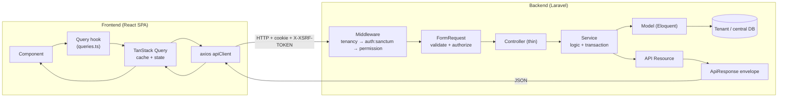
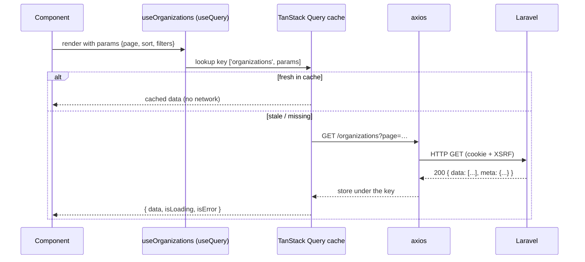
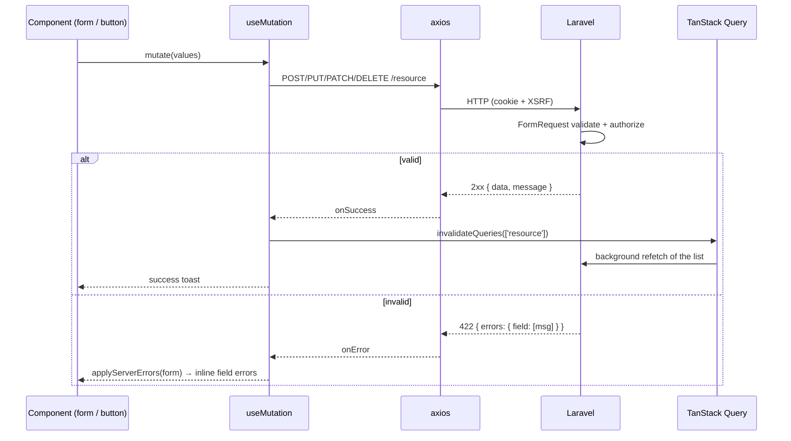

# Request Cycle — Frontend to Backend

> **Status:** Current · **Last updated:** 2026-08-19 · **Owner:** Engineering

How one request travels from a React component, through TanStack Query and the
axios client, across the network to Laravel's layered pipeline, and back into the
UI. Covers **GET / POST / PUT / PATCH / DELETE**.

## The big picture



Two roles on the frontend, split on purpose (see
[../design-patterns/frontend.md](../design-patterns/frontend.md)):

- **Reads (GET) → `useQuery`.** Cached, deduped, refetched, keyed by
  `queryKey`.
- **Writes (POST/PUT/PATCH/DELETE) → `useMutation`.** Not cached; on success
  they **invalidate** query keys so the affected reads refetch.

## The shared machinery

### axios client (`services/apiClient.ts`)

Every call goes through one instance: `withCredentials` + `withXSRFToken` (Sanctum
cookie auth), a per-host base URL (so a tenant subdomain calls its own backend),
and a request interceptor that strips `Content-Type` for `FormData` uploads. See
[../08-authentication-authorization/authentication-frontend.md](../08-authentication-authorization/authentication-frontend.md).

### Response envelope (`App\Helpers\ApiResponse`)

The backend answers in **one** shape, so the client always reads the same fields:

```jsonc
// success (single)                    // success (paginated)
{ "success": true,                     { "success": true,
  "message": "...",                      "message": "...",
  "data": { ... },                       "data": [ ... ],
  "errors": null }                       "meta": { "current_page": 1,
                                                   "per_page": 15,
                                                   "total": 42,
                                                   "last_page": 3 },
                                         "errors": null }
```

An error is the same envelope with `success: false`, `data: null`, and `errors`
populated (validation errors keyed by field). Framework exceptions are normalized
into this shape too (`bootstrap/app.php`).

---

## GET — reading data (`useQuery`)



```ts
export function useOrganizations(params: ServerTableParams) {
  return useQuery({
    queryKey: ['organizations', params],           // params in the key = auto refetch on change
    queryFn: async () => (await apiClient.get('/organizations', { params })).data,
    placeholderData: keepPreviousData,             // keep old rows visible while the next page loads
  })
}
```

**Backend path (GET):** `permission:organization.view` → `OrganizationController@index`
→ `OrganizationService` (query + `scopeAvailableTo`) → `paginate()` →
`ApiResponse::paginated(..., OrganizationResource::class)`.

---

## POST / PUT / PATCH / DELETE — writing data (`useMutation`)

All four writes share the same shape: an axios call in `mutationFn`, then
`invalidateQueries` in `onSuccess` so the lists refresh themselves.



### POST — create

```ts
export function useCreateOrganization() {
  const qc = useQueryClient()
  return useMutation({
    mutationFn: (values) => apiClient.post('/organizations', values),
    onSuccess: () => qc.invalidateQueries({ queryKey: ['organizations'] }),
  })
}
```
Backend: `permission:organization.create` → `store(StoreOrganizationRequest)` →
`Service::create()` (inside `DB::transaction`) → `ApiResponse::success(resource, CREATED, 201)`.

### PUT — full update

```ts
mutationFn: ({ id, ...values }) => apiClient.put(`/organizations/${id}`, values),
onSuccess: () => qc.invalidateQueries({ queryKey: ['organizations'] }),
```
Backend: `permission:organization.edit` → `update(UpdateOrganizationRequest, $organization)`
(route-model binding) → `Service::update()` → `ApiResponse::success(resource)`.

### PATCH — partial update

Used for a single-field change. Real example — toggling a module's visibility
(`hooks/useModules.ts`):

```ts
export function useSetModuleVisibility() {
  const qc = useQueryClient()
  return useMutation({
    mutationFn: ({ id, is_visible }) => apiClient.patch(`/modules/${id}`, { is_visible }),
    onSuccess: () => {
      qc.invalidateQueries({ queryKey: ['modules-list'] })
      qc.invalidateQueries({ queryKey: ['modules-tree'] }) // sidebar refreshes too
    },
  })
}
```
Backend: the controller updates just the supplied field(s) and returns the
resource. PATCH vs PUT is a **semantic** choice — PATCH = partial, PUT = replace;
both hit an update handler.

### DELETE — remove

```ts
mutationFn: (id: number) => apiClient.delete(`/organizations/${id}`),
onSuccess: () => qc.invalidateQueries({ queryKey: ['organizations'] }),
```
Backend: `permission:organization.delete` → `destroy($organization)` →
`Service::delete()` → `ApiResponse::success(null, DELETED)`.

---

## Method → layer cheat-sheet

| HTTP | Hook | Route middleware | Controller | Service | Response |
|---|---|---|---|---|---|
| GET (list) | `useQuery` | `permission:*.view` | `index` | query + paginate | `ApiResponse::paginated` |
| POST | `useMutation` | `permission:*.create` | `store` + `Store*Request` | `create` (txn) | `success(…, 201)` |
| PUT | `useMutation` | `permission:*.edit` | `update` + `Update*Request` | `update` | `success(resource)` |
| PATCH | `useMutation` | `permission:*.edit` | `update` (partial) | `update` | `success(resource)` |
| DELETE | `useMutation` | `permission:*.delete` | `destroy` | `delete` | `success(null)` |

## Cross-cutting on every request

- **Auth:** the session cookie authenticates via `auth:sanctum`; a `401` mid-use
  is caught by the interceptor in `store/index.ts` → forced logout.
- **Tenancy:** the host decides which database answers — resolved *before* auth.
- **Authorization:** enforced by backend middleware + `FormRequest::authorize()`
  (403 on failure). The client does not gate — see
  [../08-authentication-authorization/authorization-frontend.md](../08-authentication-authorization/authorization-frontend.md).
- **Errors:** `422` → inline form errors via `applyServerErrors`; other failures
  → a toast via `serverMessage`.
