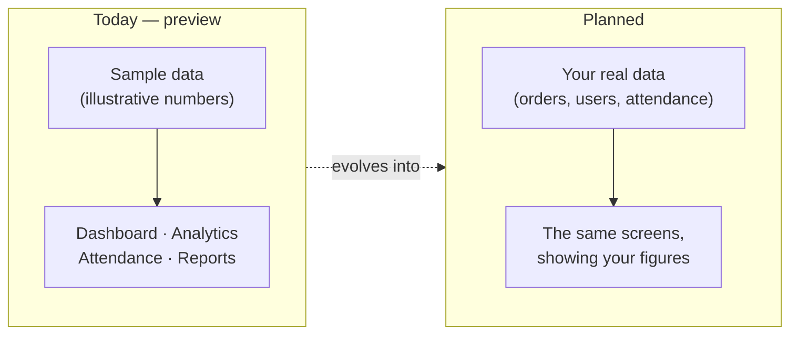
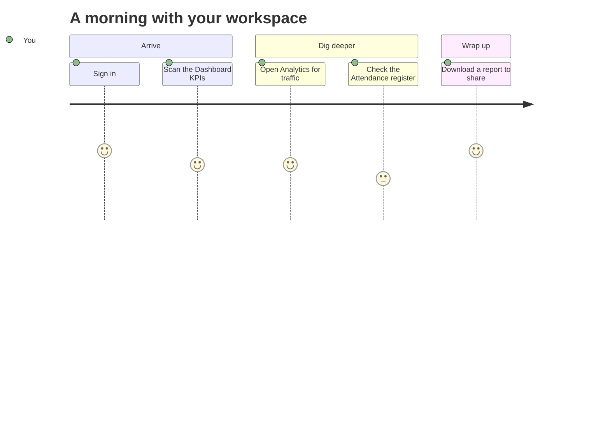
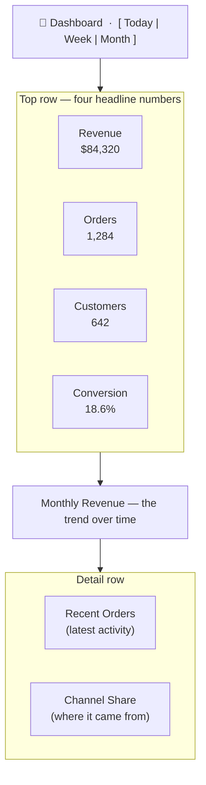
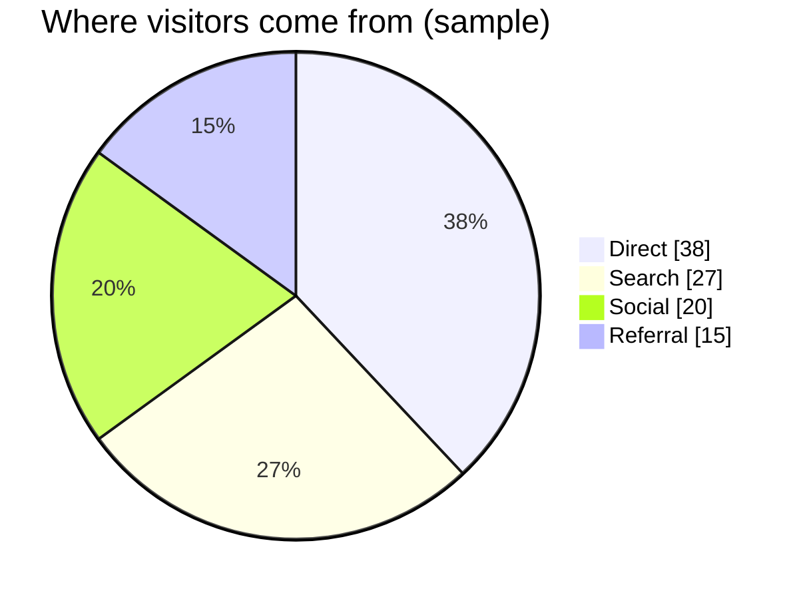
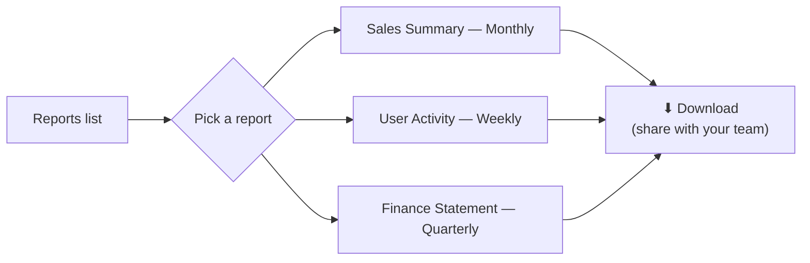
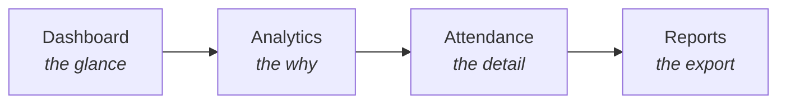

# Dashboard, Analytics & Reports

> Your workspace's "control room" — the screens that turn raw activity into a
> picture you can read at a glance.
>
> 💡 *Every diagram on this page is zoomable — hover it and click **Zoom**.*

## First, the honest bit

These four screens — **Dashboard**, **Analytics**, **Attendance**, and
**Reports** — are **finished, interactive previews filled with sample data**.
They show you exactly what the product will feel like, but the numbers are
**illustrative examples**, not your real figures yet. Think of them as a fully
furnished show-home: the layout is real, the furniture is for display.

So as you read on: enjoy the shapes and flows, and know the live wiring to your
own data is the next step.

---

## The story of a morning

Picture the start of a working day. You sign in, and instead of hunting through
tables, you get a single screen that answers *"how are things going?"* — then you
follow the thread wherever it leads.

That thread — **glance → explore → export** — is exactly what these four screens
are built to support. Let's walk each one.

---

## 1. Dashboard — the glance

> **Where:** top of the sidebar → **Dashboard**

The Dashboard is your landing screen. It's laid out top-to-bottom so the most
important numbers hit you first, with detail below.

**Reading it, top to bottom:**

- **The period switcher** (top-right): flip between **Today**, **Week**, and
  **Month** to change the window every number reflects.
- **Four stat cards:** the headline health of the workspace — *Revenue*,
  *Orders*, *Customers*, and *Conversion rate*. One glance tells you if today is
  up or down.
- **Monthly Revenue panel:** the trend line — are things climbing or dipping over
  the period?
- **Recent Orders:** the newest activity, so you can see *what* is happening, not
  just the totals.
- **Channel Share:** a breakdown of where activity comes from.

If you only ever open one screen, this is the one.

---

## 2. Analytics — the "why"

> **Where:** top of the sidebar → **Analytics**

Where the Dashboard says *what*, Analytics says *why* — it's about your audience
and how they behave.

Its headline cards cover **Page Views**, **Bounce Rate**, **Average Session**
length, and **Growth**, followed by a **Sales Trend** and a **Channel Share**
breakdown like this:

Use Analytics to answer questions the Dashboard raises: *"Orders dipped this
week — did traffic drop, or did fewer visitors convert?"*

---

## 3. Attendance — the register

> **Where:** top of the sidebar → **Attendance**

Attendance is the roll-call view (handy in an education setting). Pick a **month**
at the top, and read a register of each group with who was **present**,
**excused**, and **un-excused**.

| Class | Total | Present | Excused | Un-excused |
|---|---|---|---|---|
| Class A | 32 | 28 | 2 | 2 |
| Class B | 30 | 27 | 1 | 2 |
| Class C | 28 | 25 | 3 | 0 |
| Class D | 34 | 30 | 2 | 2 |

*(Sample register — your real groups and figures will appear here.)* Use the
**month picker** to move through time and the **search box** to jump to a
specific class.

---

## 4. Reports — the export

> **Where:** Account → **Reports**

Reports is where a summary leaves the screen and becomes a file you can share.
You get a searchable list of available reports, each with a **download** action:

**How you'll use it:** search for the report you need, then select the
**download** icon on its row. *(The one-click download is being wired up — the
list and layout are ready.)*

---

## How they fit together

Each screen is one zoom level on the same reality — from a single glance all the
way down to a shareable file:

## What's live today vs. coming next

| Screen | Live now | Coming next |
|---|---|---|
| **Dashboard** | Full layout, KPI cards, trend & activity panels, period switcher | Cards & charts driven by your real workspace data |
| **Analytics** | Layout, audience KPIs, trend & channel breakdown | Real traffic/behavior once analytics is connected |
| **Attendance** | Month picker, searchable register | Your real groups + saving/editing attendance |
| **Reports** | Searchable report list with download controls | Generated, downloadable report files |

## Tips

- Treat the numbers as **placeholders** for now — the value today is seeing how
  you'll read your data, not the sample values themselves.
- The **period switcher** (Dashboard) and **month picker** (Attendance) are the
  fastest ways to change what you're looking at.
- Every diagram here is **zoomable** — click **Zoom** to inspect it closely.
- Looking for the technical side (how these are built and will be wired up)? See
  the **Developer Guide**.
